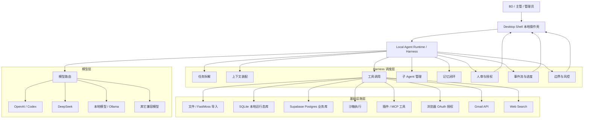

# KOL 管理工作台 Agent Harness 调度架构

## 参考来源

架构参考 OpenAI Developers 文章：

- `https://developers.openai.com/blog/codex-as-a-platform`

核心理解：

- Agent 不等于单个模型请求。
- Agent = Model + Harness。
- Harness 负责上下文、任务拆解、工具调用、状态流转、人审、边界控制和结果回传。
- 产品不应被做成通用聊天框，而应围绕真实业务工作流构建界面和系统记录。

## 对 KOL 管理工作台的架构映射



## 三层架构

### 1. 模型层

模型层只负责推理和生成，不直接拥有业务权限。

候选能力：

- OpenAI / Codex：复杂任务拆解、工具调用、长流程执行。
- DeepSeek：成本友好的文本分析、线索评分、邮件生成。
- 本地模型：低敏数据分析、模板改写、草稿初稿。
- 其它 OpenAI-compatible 模型：作为可配置扩展。

模型层要求：

- 可在设置中配置多个模型。
- 不在首页一级菜单暴露模型配置。
- 不让模型直接执行高风险动作。
- 所有模型输出都必须通过 Harness 的审核与工具层。

### 2. Harness 调度层

Harness 是项目核心，不是普通后端 API 拼接，也不是传统前后端系统里的业务服务层。

职责：

- 任务拆解：将“触达 100 个 KOL”拆成提取、筛选、生成、审核、发送、记录。
- 上下文装配：从数据集、KOL 记录、历史邮件、回复、Campaign 配置中取上下文。
- 工具调用：调用文件解析、SQLite、Gmail API、Web Search、模型 API。
- 子 Agent 管理：按任务类型分配给不同角色 Agent。
- 记忆闭环：把操作结果写回 KOL 状态、回复记录、草稿和审计日志。
- 人审与授权：所有外发、报价、账号授权动作必须经过明确确认。
- 事件流与进度：桌面 Shell 展示当前执行步骤、失败原因和可恢复状态。
- 边界与风控：控制 Gmail 额度、敏感内容、账号风险和权限范围。

### 3. 基础设施层

基础设施层提供可控工具，不做自主决策。

组成：

- 文件：FastMoss xlsx/csv/json 导入。
- SQLite：本地运行态、隐私会话、草稿正文、原始回复、状态缓存、日志和任务队列。
- Supabase Postgres：用户提供的 KOL 业务数据库，保存 KOL、联系方式、Campaign、触达摘要、回复摘要、审核任务和未来多人协作数据。
- 沙箱：本地解析、批量处理、临时文件处理。
- 插件/MCP：后续扩展 Gmail、浏览器、Web Search、CRM。
- 浏览器 OAuth：只用于用户授权，不用于保存密码或绕过登录。
- Gmail API：创建草稿、读取回复、人工确认后发送。
- Web Search：辅助补全 KOL 信息，默认不上传敏感数据。

## 子 Agent 设计

### LeadImportAgent

职责：

- 解析 FastMoss 表格。
- 字段映射。
- 邮箱和主页提取。
- 数据质量检查。

输出：

- 标准化 KOLLead。
- 缺失字段报告。
- 可触达邮箱数量。

### ScoringAgent

职责：

- KOL 分层。
- niche 匹配。
- 触达优先级评分。

输出：

- High / Medium / Low。
- 推荐触达动作。
- 风险或缺失提示。

### OutreachAgent

职责：

- 生成 Gmail 首触达草稿。
- 根据 KOL 主页、国家、类目和 Campaign 生成文案。

边界：

- 只能生成草稿。
- 不能直接发送。

### ReplyAgent

职责：

- 解析业务员手动回传或 Gmail 同步的回复。
- 判断意向、报价需求、样品需求和异议。

输出：

- 意向分类。
- 跟进建议。
- 是否需要主管审核。

### FollowupAgent

职责：

- 生成二次回复草稿。
- 根据历史邮件和回复内容保持上下文一致。

边界：

- 涉及报价、佣金、合同、样品承诺时必须进入审核。

### GmailOpsAgent

职责：

- 管理 Gmail 授权状态。
- 创建 Gmail 草稿。
- 在人工确认后执行发送。
- 读取或导入回复。

边界：

- 不保存 Gmail 密码。
- 不接管浏览器登录态。
- token 不暴露给桌面 Shell。

### AuditAgent

职责：

- 审核敏感内容。
- 检查高相似度文案。
- 检查账号限流、退信、投诉和异常风险。

输出：

- 可发送。
- 需修改。
- 需主管审核。
- 暂停账号或任务。

## 调度模式

### 开放枢纽模式

适合：

- KOL 信息补全。
- Web Search。
- 插件扩展。
- 多数据源汇聚。

特点：

- 工具开放。
- 权限按任务授权。
- 结果必须写回系统记录。

### 任务模式

适合：

- 导入数据。
- 生成草稿。
- 回传回复。
- 生成二次回复。
- 批量更新状态。

特点：

- 输入明确。
- 输出结构化。
- 可重试。
- 可审计。

### 闭源/高风险模式

适合：

- Gmail 真实发送。
- OAuth token 使用。
- 账号限流修改。
- 报价承诺。

特点：

- 权限最小化。
- 默认禁止自动执行。
- 需要用户确认。
- 全量审计。

## 状态机设计

### KOL Lead 状态

```text
imported
  -> normalized
  -> scored
  -> draft_ready
  -> pending_review
  -> sent
  -> replied
  -> followup_pending
  -> negotiated
  -> won / lost / recycled
```

### Draft 状态

```text
generated
  -> pending_review
  -> approved
  -> sent
  -> replied
  -> returned
  -> paused
```

### Gmail Account 状态

```text
not_connected
  -> oauth_pending
  -> connected
  -> active
  -> throttled
  -> paused
  -> expired
```

## 事件流

Harness 应向桌面 Shell 发出事件，用于展示进度：

- `task.created`
- `task.started`
- `context.loaded`
- `tool.called`
- `tool.succeeded`
- `tool.failed`
- `approval.required`
- `draft.generated`
- `gmail.draft_created`
- `gmail.send_requested`
- `gmail.sent`
- `reply.received`
- `task.completed`
- `task.failed`

MVP 可以先用轮询，后续改为 SSE/WebSocket。

## 人审策略

必须人审：

- Gmail 发送。
- 报价、佣金、折扣。
- 样品寄送承诺。
- 合同和合作条款。
- 高相似度批量文案。
- 首次启用 Gmail 账号。
- 修改发送限流。

可以自动：

- 数据清洗。
- 邮箱提取。
- 本地评分。
- 草稿生成。
- 回复分类初判。
- 状态建议。

## 本地优先实现建议

MVP 不必直接接入完整 Codex app-server。

建议先实现轻量 Harness：

- `TaskRunner`：任务创建、执行、失败重试。
- `ContextBuilder`：装配 KOL、草稿、回复、配置上下文。
- `ToolRegistry`：注册文件、SQLite、模型、Gmail 占位工具。
- `ApprovalGate`：统一拦截高风险动作。
- `EventLog`：记录进度和审计。
- `ModelRouter`：选择 OpenAI/DeepSeek/本地模型。
- `SyncManager`：将允许上传的业务数据同步到 Supabase，同时阻止会话、模型上下文、原始邮件和凭据上传。

后续升级：

- 接入 Codex SDK 做程序化 Agent 工作流。
- 接入 Codex app-server 做持久会话、流式事件和 approval request。
- 以 MCP 形式暴露 KOL 数据、Gmail 草稿、回复、审计日志。

## 对当前产品设计的影响

界面不应以聊天框为中心，而应以业务对象为中心：

- 线索池。
- 草稿队列。
- 回复记录。
- 审核任务。
- Gmail 账号。
- 审计日志。

Agent 入口应嵌入业务对象：

- 在线索池中生成草稿。
- 在回复中生成 follow-up。
- 在审核页解释风险。
- 在账号页解释暂停原因。

## 关键原则

1. 模型可替换，Harness 不可缺。
2. 工具可扩展，权限必须收敛。
3. Agent 可建议，人必须确认高风险动作。
4. 工作台拥有系统记录，Agent 只通过工具修改记录。
5. 不做通用聊天盒子，做嵌入业务流程的 Agent。
6. Supabase 保存业务事实，本地保存会话过程。
# 2026-08-22 本轮架构补充

- ModelRouter 已进入 MVP：文案生成、AI 模板生成和 follow-up 生成必须通过本地 Harness 调用配置模型。
- SecretStore 已进入 MVP：模型 API Key 通过 Windows DPAPI 加密后保存在本地 SQLite，不进入桌面 Shell localStorage。
- GmailOpsAgent 当前仍是安全占位：保存 Gmail 邮箱与浏览器/Profile 配置，不读取密码、cookie、2FA 或登录态。
- ApprovalGate 仍保持：草稿生成后进入 pending_review，人工确认仅记录本地 sent_recorded，真实 Gmail 外发仍未实现。
- DraftLifecycle 新增 archived/delete/restore，用于控制草稿队列积压。
# 2026-08-22 Gmail Batch Harness Update

- Local Harness now owns batch mail lifecycle operations for local draft and reply records.
- Batch archive/delete operations require explicit selected ids from the Desktop Shell and do not call real Gmail.
- Default template selection is a Harness-level context choice: if the user does not select a template, first-touch draft generation loads the local default template for the language/scenario.

# 2026-08-22 Reply Template Harness Update

- Template management is treated as a local Harness tool capability.
- `save_template` handles create/update, and `delete_template` handles local deletion with audit logging.
- Template deletion does not cascade into generated drafts because drafts are independent local runtime records after rendering.

# 2026-08-22 Multilingual Outreach Harness Update

- OutreachAgent now receives an explicit draft language code from the Desktop Shell and maps it to a readable target language for model prompts.
- FollowupAgent receives the selected reply follow-up draft language through `/api/replies` instead of hard-coding English.
- ModelRouter prompts must instruct the model to write the full subject/body in the requested language while preserving brand, platform, and product names when appropriate.
- Default template lookup is language-scoped; Harness should not silently apply a default template from a different language.
- Multilingual template generation uses the same local-only template tool path and must still pass through human review before any Gmail action.

# 2026-08-26 Gmail Settings Harness Update

- GmailOpsAgent settings now distinguish browser executable path, optional browser profile/account-group label, and Gmail account email.
- The local Harness can create multiple Gmail account placeholders from one browser configuration, but each account remains independently addressable for future queueing and rate limits.
- Browser path selection is exposed as a local desktop utility through the Agent runtime, not as a remote web capability.
- Future OAuth work should attach authorization state to each Gmail account placeholder without reading browser cookies or taking over existing login sessions.

# 2026-08-26 Gmail Folder Picker Harness Update

- GmailOpsAgent settings now treat the browser executable path and Profile/User Data folder path as separate local inputs.
- The desktop utility route `/api/system/select-path` supports both file and directory selection and returns only the chosen local path string.
- Folder selection is configuration assistance only; it does not inspect browser profiles, cookies, passwords, or login state.

# 2026-08-26 Gmail Picker Process Isolation Update

- `/api/system/select-path` now opens the native Tk picker in an isolated Python subprocess rather than directly inside the threaded HTTP handler.
- This keeps the Harness desktop utility synchronous from the API caller's perspective while avoiding Tk thread-surface problems on Windows.

# 2026-08-26 Gmail Picker Context Update

- `/api/system/select-path` accepts `initialPath` and `browserHint` as local-only picker context.
- The Agent runtime uses this context only to choose a friendly starting directory for file/folder selection.
- This helper still does not inspect browser data or infer Gmail authorization state.
