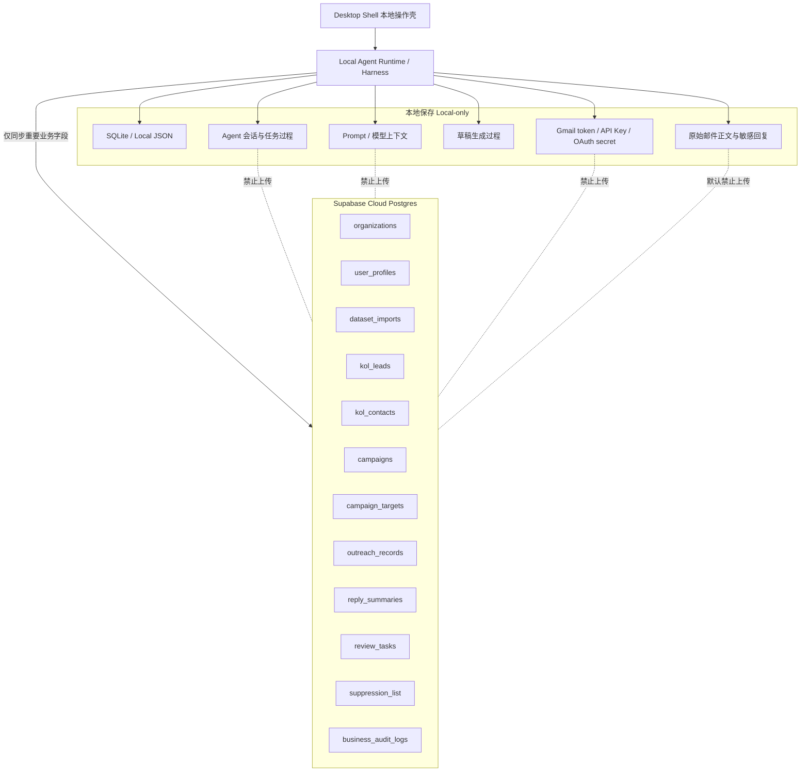

# KOL 管理工作台 Supabase 数据库架构

## 核心原则

本项目采用“本地 Agent 运行态 + Supabase 业务数据库”的混合架构。

必须严格区分：

- Supabase：用户提供的 KOL 业务数据库，保存需要长期沉淀、后续可能多人协作共享的业务事实。
- 本地 Agent Runtime：保存 Agent 会话处理、模型上下文、提示词、草稿生成过程、Gmail token、模型 API Key、原始邮件正文等敏感或运行态数据。

用户明确要求：所有会话处理保存在本地，不上传数据库。

## 参考依据

Supabase 每个项目提供完整 Postgres 数据库，可用于连接、管理和保护业务数据。面向客户端访问的数据表必须启用 Row Level Security，并通过 RLS policy 限制访问。service role 或 secret key 不得暴露在桌面 Shell。

## 总体架构

## 数据分层

### A. 必须本地保存，不上传 Supabase

| 数据 | 原因 | 保存位置 |
| --- | --- | --- |
| Agent 会话全文 | 包含模型上下文、推理过程、临时数据 | 本地 SQLite/JSON |
| 任务运行过程 | 包含工具调用细节、失败堆栈、临时文件路径 | 本地 SQLite/JSON |
| Prompt 模板运行实例 | 可能包含客户策略、产品资料和敏感表达 | 本地 |
| 模型请求和响应原文 | 可能包含隐私、商业策略和邮件内容 | 本地 |
| Gmail OAuth token | 高敏凭据 | Windows Credential Manager / DPAPI |
| Gmail 密码、2FA、cookie | 禁止保存 | 不保存 |
| 模型 API Key | 高敏凭据 | 系统凭据库 |
| 原始邮件正文 | 可能包含隐私和商业信息 | 默认本地 |
| 未审核 AI 草稿正文 | 可能包含错误承诺或敏感信息 | 本地 |
| 上传原始文件 | 数据量大且可能含敏感列 | 默认本地 |

### B. 可上传 Supabase 的重要业务数据

| 数据 | 上传方式 | 说明 |
| --- | --- | --- |
| KOL 标准档案 | 默认上传 | 昵称、平台、主页、国家、类目、公开指标 |
| KOL 联系方式 | 默认上传但受权限保护 | 邮箱、WhatsApp、其它公开联系方式 |
| 数据集元信息 | 上传 | 文件名、导入时间、行数、字段映射摘要，不上传原始文件 |
| Campaign | 上传 | 活动名称、目标市场、niche、状态 |
| 目标人群关系 | 上传 | Campaign 与 KOL 的关联 |
| 触达状态 | 上传 | pending、drafted、sent、replied、won、lost |
| 发送记录摘要 | 上传 | 发送账号、时间、主题摘要、状态，不上传正文 |
| 回复摘要 | 可上传 | 意向分类、报价需求、下一步动作，不上传原始全文 |
| 审核任务摘要 | 上传 | 审核状态、风险标签、审核人、时间 |
| suppression list | 上传 | 停止联系、退订、黑名单 |
| 业务审计日志 | 上传 | 业务级动作，不包含模型上下文和密钥 |

## Supabase 表设计

### 1. organizations

用于未来多人协作版本。单机 MVP 也可使用一个默认 organization。

| 字段 | 类型 | 说明 |
| --- | --- | --- |
| id | uuid pk | 组织 ID |
| name | text | 组织名称 |
| plan | text | local/sync/team |
| created_at | timestamptz | 创建时间 |

### 2. user_profiles

| 字段 | 类型 | 说明 |
| --- | --- | --- |
| id | uuid pk | 对应 Supabase auth.users |
| org_id | uuid fk | 组织 |
| email | text | 登录邮箱 |
| display_name | text | 显示名 |
| role | text | admin/manager/bd/viewer |
| created_at | timestamptz | 创建时间 |

### 3. dataset_imports

只保存导入摘要，不上传原始文件和会话处理过程。

| 字段 | 类型 | 说明 |
| --- | --- | --- |
| id | uuid pk | 数据集 ID |
| org_id | uuid fk | 组织 |
| local_dataset_id | text | 本地数据集 ID |
| source | text | fastmoss/csv/manual |
| filename | text | 文件名 |
| row_count | integer | 行数 |
| email_count | integer | 邮箱数量 |
| field_map | jsonb | 字段映射摘要 |
| imported_by | uuid | 导入人 |
| imported_at | timestamptz | 导入时间 |

### 4. kol_leads

KOL 主档案，保存可协作的核心业务数据。

| 字段 | 类型 | 说明 |
| --- | --- | --- |
| id | uuid pk | KOL ID |
| org_id | uuid fk | 组织 |
| dataset_id | uuid fk | 数据集 |
| platform | text | TikTok/Instagram/YouTube |
| handle | text | 达人昵称 |
| homepage_url | text | 主页 |
| fastmoss_url | text | FastMoss 链接 |
| country | text | 国家 |
| language | text | 语言 |
| category | text | 类目 |
| commerce_niche | text | 带货倾向 |
| followers | bigint | 粉丝 |
| avg_views | bigint | 平均播放 |
| engagement_rate | numeric | 互动率 |
| sales_28d | bigint | 近 28 天销量 |
| score | numeric | 综合评分 |
| priority | text | high/medium/low |
| status | text | imported/scored/drafted/sent/replied/won/lost/recycled |
| created_at | timestamptz | 创建时间 |
| updated_at | timestamptz | 更新时间 |

推荐约束：

- `(org_id, platform, homepage_url)` 唯一，避免重复主页。
- `(org_id, handle, platform)` 可建辅助索引。

### 5. kol_contacts

联系方式单独建表，便于权限收敛和去重。

| 字段 | 类型 | 说明 |
| --- | --- | --- |
| id | uuid pk | 联系方式 ID |
| org_id | uuid fk | 组织 |
| kol_id | uuid fk | KOL |
| type | text | email/whatsapp/instagram/linktree/other |
| value | text | 联系方式 |
| normalized_value | text | 标准化值 |
| source | text | fastmoss/manual/enriched |
| is_primary | boolean | 是否主联系方式 |
| is_valid | boolean | 是否有效 |
| created_at | timestamptz | 创建时间 |

推荐约束：

- `(org_id, type, normalized_value)` 唯一。

### 6. campaigns

| 字段 | 类型 | 说明 |
| --- | --- | --- |
| id | uuid pk | Campaign ID |
| org_id | uuid fk | 组织 |
| name | text | 活动名 |
| market | text | 市场 |
| niche | text | 目标 niche |
| product_brief_ref | text | 本地产品资料引用，不上传全文 |
| status | text | draft/active/paused/done |
| created_by | uuid | 创建人 |
| created_at | timestamptz | 创建时间 |

### 7. campaign_targets

Campaign 与 KOL 关系表。

| 字段 | 类型 | 说明 |
| --- | --- | --- |
| id | uuid pk | ID |
| org_id | uuid fk | 组织 |
| campaign_id | uuid fk | Campaign |
| kol_id | uuid fk | KOL |
| stage | text | selected/drafted/reviewing/sent/replied/followup/won/lost |
| assigned_to | uuid | 负责人 |
| next_action | text | 下一步 |
| next_action_at | timestamptz | 下一步时间 |
| created_at | timestamptz | 创建时间 |

### 8. outreach_records

保存触达摘要，不上传完整会话和未审核正文。

| 字段 | 类型 | 说明 |
| --- | --- | --- |
| id | uuid pk | 触达记录 |
| org_id | uuid fk | 组织 |
| campaign_id | uuid fk | Campaign |
| kol_id | uuid fk | KOL |
| contact_id | uuid fk | 联系方式 |
| channel | text | gmail/whatsapp/manual |
| gmail_account_ref | text | Gmail 账号引用或邮箱 |
| local_draft_id | text | 本地草稿 ID |
| subject_summary | text | 主题摘要 |
| status | text | drafted/pending_review/approved/sent/failed/paused |
| risk_labels | text[] | 风险标签 |
| sent_at | timestamptz | 发送时间 |
| created_at | timestamptz | 创建时间 |

严禁字段：

- 不存完整邮件正文。
- 不存模型生成过程。
- 不存 Gmail message raw。

### 9. reply_summaries

只上传结构化摘要。原始回复全文默认本地。

| 字段 | 类型 | 说明 |
| --- | --- | --- |
| id | uuid pk | 回复摘要 ID |
| org_id | uuid fk | 组织 |
| campaign_id | uuid fk | Campaign |
| kol_id | uuid fk | KOL |
| outreach_id | uuid fk | 触达记录 |
| local_reply_id | text | 本地回复 ID |
| intent | text | high_intent/quote_needed/sample_needed/rejected/noise |
| quote_requested | boolean | 是否询价 |
| sample_requested | boolean | 是否要样品 |
| next_action | text | 下一步 |
| reply_at | timestamptz | 回复时间 |
| created_at | timestamptz | 创建时间 |

可选字段：

- `sanitized_excerpt text`：脱敏短摘要，最多 300 字，需用户开启。

### 10. review_tasks

| 字段 | 类型 | 说明 |
| --- | --- | --- |
| id | uuid pk | 审核任务 ID |
| org_id | uuid fk | 组织 |
| target_type | text | outreach/reply/campaign/account |
| target_id | uuid | 目标 ID |
| local_ref | text | 本地对象 ID |
| risk_labels | text[] | 风险标签 |
| status | text | pending/approved/rejected/returned |
| reviewer_id | uuid | 审核人 |
| reviewed_at | timestamptz | 审核时间 |
| created_at | timestamptz | 创建时间 |

### 11. suppression_list

| 字段 | 类型 | 说明 |
| --- | --- | --- |
| id | uuid pk | ID |
| org_id | uuid fk | 组织 |
| type | text | email/domain/kol |
| value | text | 邮箱、域名或 KOL |
| reason | text | unsubscribe/bounce/complaint/manual |
| created_by | uuid | 创建人 |
| created_at | timestamptz | 创建时间 |

### 12. business_audit_logs

业务级审计日志，不保存模型会话、密钥或完整邮件正文。

| 字段 | 类型 | 说明 |
| --- | --- | --- |
| id | uuid pk | 日志 ID |
| org_id | uuid fk | 组织 |
| actor_id | uuid | 操作人 |
| action | text | 操作 |
| target_type | text | 对象类型 |
| target_id | uuid | 对象 ID |
| summary | text | 操作摘要 |
| metadata | jsonb | 非敏感元数据 |
| created_at | timestamptz | 时间 |

## 本地运行态数据库设计

本地建议使用 SQLite，但它不是 KOL 业务主数据库。它只承担 Agent 运行态、隐私内容、本地缓存和同步队列。

本地表：

- `local_agent_sessions`
- `local_agent_tasks`
- `local_task_events`
- `local_model_messages`
- `local_prompts`
- `local_draft_bodies`
- `local_raw_replies`
- `local_file_imports`
- `local_secret_refs`
- `local_sync_queue`

### local_agent_sessions

保存完整 Agent 会话和运行上下文。

必须本地，禁止同步。

字段建议：

- `id`
- `title`
- `task_type`
- `local_dataset_id`
- `created_at`
- `updated_at`
- `status`
- `summary`

### local_model_messages

保存模型输入输出和上下文。

必须本地，禁止同步。

字段建议：

- `id`
- `session_id`
- `role`
- `content`
- `model`
- `tokens`
- `created_at`

### local_draft_bodies

保存完整邮件草稿正文。

默认本地，只有发送摘要同步 Supabase。

字段建议：

- `id`
- `local_draft_id`
- `kol_id`
- `subject`
- `body`
- `version`
- `created_at`

## 同步策略

### 单向同步到 Supabase

默认同步：

- KOL 标准档案。
- KOL 联系方式。
- Campaign。
- 触达状态摘要。
- 回复意向摘要。
- 审核任务摘要。
- suppression list。

不同步：

- Agent session。
- 模型 messages。
- 原始 prompt。
- 原始邮件正文。
- 未脱敏回复全文。
- token/key/cookie。

### 同步队列

本地维护 `local_sync_queue`：

| 字段 | 说明 |
| --- | --- |
| id | 同步任务 ID |
| entity_type | kol/contact/campaign/outreach/reply/review |
| entity_id | 本地实体 ID |
| operation | upsert/delete |
| payload_hash | payload 哈希 |
| status | pending/synced/failed |
| retry_count | 重试次数 |
| last_error | 错误 |
| created_at | 创建时间 |

### 冲突处理

MVP：

- 本地为主。
- Supabase 作为业务数据备份和协作预留。
- 同一字段冲突时以 `updated_at` 更新者为准。

多人协作版：

- 引入 `version` 或 `updated_by`。
- 对审核状态、发送状态采用状态机约束，不允许回退覆盖。

## RLS 与权限策略

所有 Supabase 表必须启用 RLS。

角色：

- `admin`
- `manager`
- `bd`
- `viewer`

基础策略：

- 用户只能访问自己 `org_id` 下的数据。
- BD 可读写自己负责的 campaign_targets、outreach_records、reply_summaries。
- Manager 可审核同组织 review_tasks。
- Admin 可管理组织配置和人员。
- Viewer 只读聚合数据，不可查看联系方式明细。

高敏表：

- `kol_contacts`
- `outreach_records`
- `reply_summaries`
- `review_tasks`

这些表需要更严格 RLS。

## 密钥与环境变量

桌面 Shell 允许：

- Supabase publishable key。

桌面 Shell 禁止：

- Supabase service role key。
- Gmail OAuth client secret。
- Gmail refresh token。
- 模型 API Key。

本地 Agent Runtime 保存：

- Supabase service role key：仅在用户明确启用后台同步时使用，存系统凭据库。
- Gmail refresh token：系统凭据库。
- 模型 API Key：系统凭据库。

## 数据上传默认策略

默认上传：

- KOL 基础资料。
- KOL 联系方式。
- KOL 评分和状态。
- Campaign 基础信息。
- 触达/回复/审核摘要。

默认不上传：

- 原始 Excel 文件。
- 原始邮件正文。
- AI 草稿全文。
- 模型会话。
- Agent 任务过程。
- 密钥和 token。

用户可选上传：

- 脱敏回复摘要。
- 邮件主题摘要。
- 产品资料引用。

## API 边界

本地 Agent Runtime 控制接口：

- `/local/sessions/*`
- `/local/tasks/*`
- `/local/drafts/*`
- `/local/replies/raw/*`
- `/local/secrets/*`

这些只读写本地。

Supabase 同步 API：

- `/sync/kols`
- `/sync/contacts`
- `/sync/campaigns`
- `/sync/outreach-records`
- `/sync/reply-summaries`
- `/sync/review-tasks`

这些只发送脱敏业务数据。

## 开发顺序建议

### 阶段 1：本地 Agent 优先

- SQLite 暂存运行态、本地缓存和会话数据。
- 建立数据分类和本地 ID。
- 尚未接入 Supabase 时，可离线试用导入、分析和草稿生成。

### 阶段 2：Supabase 作为业务数据库

- 创建 Supabase schema。
- 让 KOL、Contact、Campaign、Outreach 摘要进入 Supabase。
- 开启 RLS。
- 验证 service role 不出现在桌面 Shell。

### 阶段 3：多人协作预留

- Supabase Auth。
- organization/user_profiles。
- role-based RLS。
- review_tasks 协作。

### 阶段 4：Gmail 安全接入

- Gmail OAuth token 仍本地。
- Supabase 只保存 Gmail account 的非敏感状态引用。
- Gmail 原始邮件默认本地。

## 验收标准

数据库架构验收：

- 所有 Supabase 表启用 RLS。
- service role key 不出现在桌面 Shell。
- Agent 会话表不存在于 Supabase。
- 模型消息表不存在于 Supabase。
- Gmail token 不存在于 Supabase。
- AI 草稿正文默认不上传 Supabase。
- KOL 基础信息可同步到 Supabase。
- 回复只同步结构化摘要。
- 本地可以离线继续处理会话。

## 结论

Supabase 应作为 KOL 业务数据和未来协作能力的云端数据库，而不是 Agent 运行态数据库；本地 Agent 才是计算和会话处理主体。

本项目的正确边界是：

- 云端保存“业务事实”。
- 本地保存“会话过程”。
- 凭据进入“系统安全凭据库”。
- 外发动作走“人审和审计”。
# 2026-08-22 本轮数据边界补充

- 模型 API Key 当前使用 Windows DPAPI 加密后保存在本地 SQLite `app_settings`，不上传 Supabase。
- Gmail 多浏览器授权配置当前保存在本地 SQLite `gmail_accounts`，仅包含邮箱、浏览器名称、Profile 路径、备注和占位授权状态。
- 开发期账号占位资料保存在本地 SQLite `local_user_profiles`；密码和正式登录凭据尚未实现。
- 草稿正文仍本地保存；草稿状态可变为 `pending_review`、`sent_recorded`、`archived`，删除为本地硬删除。
- 后续如果将加密凭据放入数据库，需要重新设计密钥管理、轮换和访问审计；不得直接把明文 token/API Key 上传 Supabase。
# 2026-08-22 Gmail Batch Data Boundary

- Gmail batch archive/delete currently changes local SQLite runtime records only.
- `replies.archived_at` is local-only because raw reply text remains local-only.
- `reply_templates.is_default` is local-only in the MVP; future shared template defaults require an approved sanitized template sync design.
- Model provider responses are used only to choose a model name in settings and are not synced to Supabase.

# 2026-08-22 Reply Template Data Boundary

- Reply template subject/body are currently stored only in local SQLite.
- Template create/update/delete actions are not synced to Supabase in the MVP.
- A future shared template library may sync sanitized metadata or approved template versions, but must not sync model prompts, generated draft bodies, or raw reply content by default.

# 2026-08-22 Multilingual Draft Data Boundary

- Draft language codes may be used as non-sensitive metadata for local filtering and future business summaries.
- Generated multilingual draft subject/body remain local-only runtime data and are not uploaded to Supabase by default.
- Multilingual reply template subject/body remain local-only in the MVP.
- If future shared template sync is approved, only explicitly approved template versions or sanitized metadata should be synced; model prompts and generated draft bodies remain excluded.

# 2026-08-26 Gmail Settings Data Boundary

- Gmail browser executable paths, browser profile/account-group labels, and Gmail account placeholders are stored only in local SQLite during the MVP.
- Browser path selection does not grant Gmail access and must not be treated as OAuth authorization.
- Future Supabase sync may store non-sensitive Gmail account status summaries, but browser paths, OAuth tokens, cookies, passwords, 2FA codes, and browser login state must remain local-only or be excluded entirely.
- Multiple Gmail accounts under one browser configuration should still be represented as separate account records for future per-account throttling and audit summaries.

# 2026-08-26 Gmail Folder Picker Data Boundary

- Browser Profile/User Data folder paths are local machine configuration data and must remain local-only.
- Supabase must not receive browser executable paths, Profile/User Data folder paths, cookies, OAuth tokens, passwords, or browser login-state references.
- Future cloud summaries may reference an account alias/status, but not the local filesystem paths used to launch or identify that account.

# 2026-08-26 Gmail Picker Context Data Boundary

- Picker `initialPath` and `browserHint` are transient local UI context values.
- They must not be uploaded to Supabase, logged as cloud audit data, or treated as Gmail authorization evidence.
